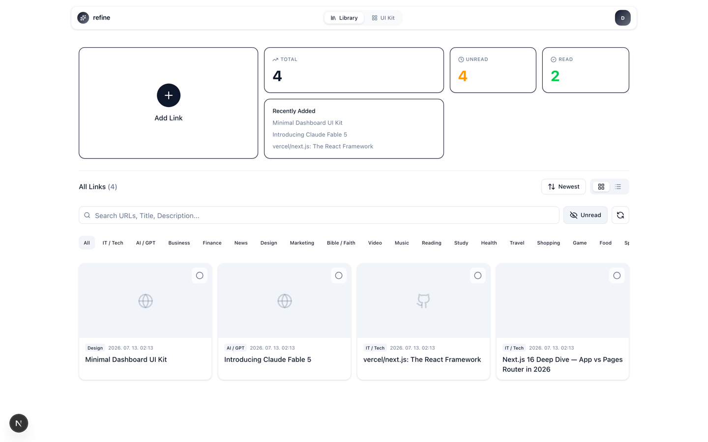
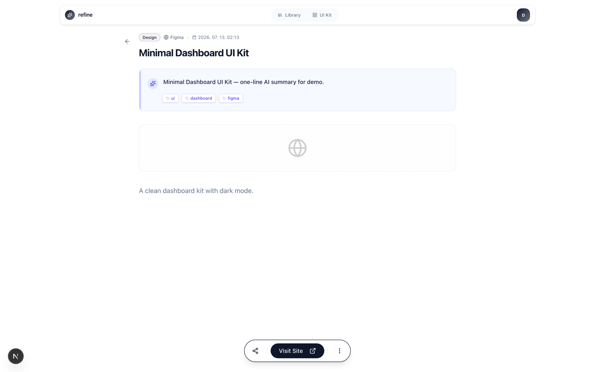
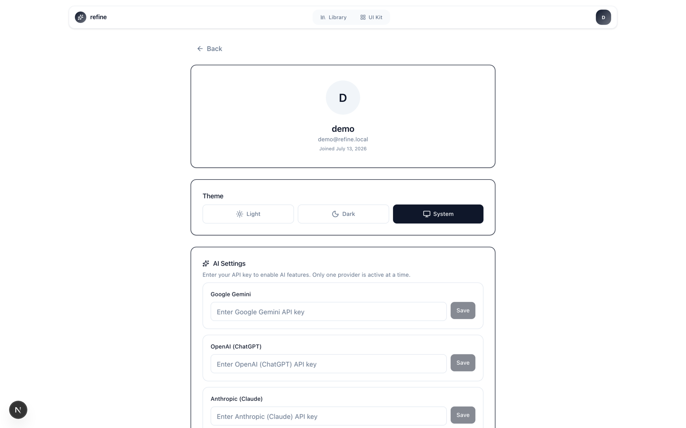
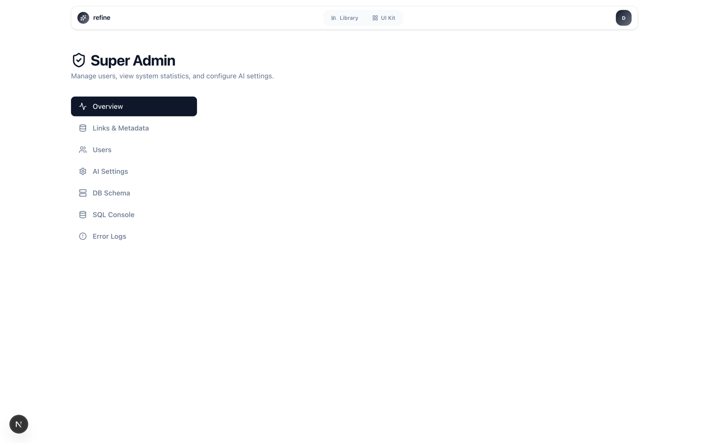

# Refine - AI-Powered Link Collector

> **Curate your knowledge** -- A PWA app for collecting, organizing, and enriching links with AI

**English** | [한국어](./README_KO.md)

**[Live Demo](https://refine-rust.vercel.app/)**

A personal bookmark manager that automatically collects shared links from mobile, classifies them with AI, and enriches content with summaries and tags.

[](https://nextjs.org/)
[](https://www.typescriptlang.org/)
[](https://supabase.com/)
[](https://ai.google.dev/)
[](https://tailwindcss.com/)

---

## Screenshots

| Dashboard | Link Detail (AI summary & tags) |
|---|---|
|  |  |

| AI Settings | Admin Dashboard |
|---|---|
|  |  |

---

## Features

### Core
- **PWA Share Target** -- Save links directly from mobile native share sheet
- **Link CRUD** -- Create, Read, Update, Delete operations
- **Duplicate Detection** -- Smart URL normalization and duplicate checking
- **Inbox/Archive** -- Read/Unread status management
- **Grid/List View** -- Toggle between card grid and compact list

### AI (Gemini)
- **Auto Category Classification** -- AI classifies links into 23+ categories on save
- **AI Summary** -- One-sentence summary generation (supports English/Korean)
- **AI Tag Extraction** -- Up to 5 relevant keywords per link
- **Bulk Backfill** -- Batch AI enrichment for existing links (category + summary + tags)
- **Individual Enrich** -- Manual AI enrichment per link from detail page
- **Per-user AI Settings** -- Provider API keys (Gemini / OpenAI / Claude), auto features toggle, output language

> **Note:** AI enrichment currently runs on **Google Gemini** (server-side `GEMINI_API_KEY`). OpenAI (ChatGPT) and Anthropic (Claude) API keys can be registered in Settings, but multi-provider execution is not wired up yet -- it's on the roadmap.

### Category Management
- **Custom Categories** -- Add, delete, reorder via dedicated management page
- **Drag & Drop Sort** -- Visual reorder with persistence
- **Link Count** -- Per-category link statistics
- **Default Categories** -- Auto-initialized 23 categories for new users

### Search & Filter
- **Server-side Search** -- Debounced search by title, URL, description
- **Category Filtering** -- Filter by any category
- **Read Status Filter** -- All / Unread / Read
- **Sort Options** -- Newest, Oldest, Title (A-Z/Z-A), Platform, Category

### Media Integration
- **YouTube Player** -- Embedded player for videos and Shorts
- **Playlist Support** -- Auto-load and navigate playlists
- **Image Carousel** -- Multi-image display for Instagram and similar
- **OG Image Scraping** -- Automatic thumbnail extraction

### Platform Detection & Scraping
- **100+ Platform Recognition** -- Data-map based detection (YouTube, Notion, Figma, Discord, Spotify, Stack Overflow, etc.)
- **Auto Domain Fallback** -- Unknown sites auto-extract site name from domain
- **Smart User-Agent** -- Platform-specific user agents for reliable scraping
- **Username Extraction** -- URL-based username parsing for 7 platforms
- **Author Detection** -- Meta tag extraction
- **Platform Metadata** -- GitHub stars/forks, Twitter oEmbed, YouTube thumbnails

### Internationalization (i18n)
- **English / Korean** -- Full bilingual support with 240 translation keys
- **Locale Switching** -- Header dropdown + Settings page language selection
- **AI Output Language** -- Per-user preferred language for AI summaries and tags

### Authentication & Security
- **Google OAuth** -- One-click sign in via Supabase Auth
- **Multi-user** -- Isolated data per user with Row Level Security
- **Secure API** -- All mutable endpoints require authentication
- **Rate Limiting** -- 10 req/min per user on all write endpoints
- **Security Headers** -- X-Frame-Options, X-Content-Type-Options, Referrer-Policy, etc.
- **Input Validation** -- Field whitelisting on update, sortBy validation on admin queries

### Admin Dashboard
- **Access** -- Grant admin via the `admin_users` table (see [Admin Account Setup](#admin-account-setup-optional)), then open `/admin`. The login page also has a hidden email/password admin form (`Ctrl + Shift + Q`)
- **System Stats** -- Total users, global link counts, recent platform activity
- **User Management** -- View all users, toggle admin privileges, delete accounts, inspect user details
- **Database Tools** -- Live schema inspector (tables, functions, RLS policies) and SQL console
- **Error Logs** -- Application error monitoring with level/source filtering and stack trace viewer

### Error Monitoring
- **Supabase-based Error Logging** -- Errors stored in `error_logs` table (replaceable with Sentry for production)
- **Client Error Capture** -- React ErrorBoundary sends errors to `/api/error-log`
- **API Error Logging** -- Standardized `apiError()` utility logs server errors automatically
- **Admin Error Logs Tab** -- View, filter, and clear error logs from admin dashboard

---

## Tech Stack

| Category | Technology |
|----------|------------|
| **Framework** | Next.js 16 (Pages Router) |
| **Language** | TypeScript |
| **UI** | React 19 + shadcn/ui |
| **Styling** | Tailwind CSS 4 |
| **Animation** | Framer Motion |
| **Database** | Supabase (PostgreSQL) |
| **Auth** | Supabase Auth (Google OAuth) |
| **AI** | Google Gemini 2.0 Flash |
| **PWA** | @ducanh2912/next-pwa |
| **i18n** | next-i18next (en, ko) |
| **Icons** | Lucide React |
| **Scraping** | Cheerio |
| **Data Fetching** | SWR |
| **Testing** | Vitest |

---

## Project Structure

```
refine/
├── __tests__/                      # Test suites
├── components/
│   ├── common/                     # Reusable (Toast, PlatformIcon, ErrorBoundary, Skeleton)
│   ├── layout/                     # LayoutShell, Header
│   ├── modules/                    # Feature components
│   │   ├── admin/                  # Admin tabs (Dashboard, Users, Schema, SQL, ErrorLogs)
│   │   └── link/                   # Link detail (CategoryEditModal, YoutubePlayer, LinkDetailCard)
│   └── ui/                         # shadcn/ui primitives
├── contexts/
│   └── AuthContext.tsx
├── hooks/                          # Custom hooks
│   ├── useLinks.ts                 # Link data fetching, filtering, pagination, error state
│   ├── useLinkActions.ts           # CRUD operations with error state
│   ├── useCategories.ts            # Category management
│   └── useYoutubePlaylist.ts       # YouTube playlist navigation
├── lib/
│   ├── api-response.ts             # Standardized API error/success responses
│   ├── auth.ts                     # API auth (withAuth, withAdmin)
│   ├── constants.ts                # Categories, configs
│   ├── error-logger.ts             # Supabase-based error logging
│   ├── gemini.ts                   # AI: classify, summarize, extractTags (10s timeout)
│   ├── platforms/                  # Platform detection (100+ sites)
│   ├── server/                     # Server-only modules
│   │   ├── rate-limit.ts           # In-memory rate limiting (10 req/min)
│   │   ├── scraper.ts              # OG scraper (5s timeout)
│   │   ├── storage.ts              # Supabase Storage image upload (5s timeout)
│   │   └── platform-metadata.ts    # Platform-specific metadata
│   ├── supabase.ts                 # Supabase client factory
│   ├── url.ts                      # URL normalization
│   └── utils.ts
├── pages/
│   ├── api/                        # All routes use withAuth + rate limiting
│   ├── auth/                       # OAuth flow
│   ├── admin/                      # Admin dashboard
│   ├── link/[id].tsx               # Link detail page
│   ├── categories.tsx              # Category management
│   ├── index.tsx                   # Main dashboard
│   ├── profile.tsx                 # Settings (theme, AI, language, stats)
│   └── share.tsx                   # PWA share receiver
├── public/locales/                 # i18n translations (en, ko)
├── supabase/migrations/            # Database migrations (001-009)
└── vitest.config.ts
```

---

## Database Schema

### Core Tables

| Table | Description |
|-------|-------------|
| `shared_links` | Main link storage (url, title, platform, category, is_read, user_id) |
| `link_metadata` | Platform-specific fields + AI results (ai_summary, ai_tags) |
| `link_images` | Multiple images per link (storage_path, original_url) |
| `user_categories` | Custom categories per user with sort_order |
| `ai_settings` | Per-user AI provider config and preferences |
| `admin_users` | Admin role tracking |
| `error_logs` | Application error logging (level, source, message, stack, path) |

All tables use **Row Level Security (RLS)** scoped by user_id.

### Performance Indexes

```sql
idx_shared_links_user_is_read     (user_id, is_read)
idx_shared_links_user_category    (user_id, category)
idx_shared_links_user_created_at  (user_id, created_at DESC)
```

---

## API Endpoints

| Method | Endpoint | Description | Auth | Rate Limit |
|--------|----------|-------------|------|------------|
| `POST` | `/api/save-shared-content` | Save link + AI classify/summarize/tag | Yes | Yes |
| `POST` | `/api/enrich-link` | Individual AI enrichment | Yes | Yes |
| `POST` | `/api/backfill-categories` | Bulk AI backfill (category + summary + tags) | Yes | Yes |
| `GET` | `/api/check-duplicate` | Check URL duplicates | Yes | - |
| `GET/POST/DELETE/PATCH` | `/api/categories` | Category CRUD + reorder | Yes | Mutable only |
| `GET` | `/api/link/[id]` | Link detail + metadata (owner only) | Yes | - |
| `DELETE` | `/api/delete-link` | Delete link | Yes | Yes |
| `PATCH` | `/api/toggle-read` | Toggle read status | Yes | Yes |
| `PATCH` | `/api/update-link` | Update link (field whitelist) | Yes | Yes |
| `GET` | `/api/playlist` | YouTube playlist | Yes | - |
| `GET/PATCH` | `/api/settings` | User AI settings | Yes | - |
| `POST` | `/api/error-log` | Client error collection | Optional | - |
| `POST` | `/api/dispatch/cura` | Dispatch link to external Cura service | Yes | - |

### Admin Endpoints (require admin role)
| Method | Endpoint | Description |
|--------|----------|-------------|
| `GET` | `/api/admin/stats` | System statistics |
| `GET/PUT/DELETE` | `/api/admin/db` | Database CRUD (whitelist tables + sortBy validation) |
| `POST/GET` | `/api/admin/sql` | SQL console (SELECT only) |
| `GET/PUT/DELETE` | `/api/admin/users` | User management |

---

## Getting Started

### Prerequisites
- Node.js 18+
- pnpm 10+
- Supabase project
- Google Gemini API key

### Environment Variables

Copy [`.env.example`](./.env.example) to `.env.local` and fill in your keys:

```env
NEXT_PUBLIC_SUPABASE_URL=https://your-project.supabase.co
NEXT_PUBLIC_SUPABASE_ANON_KEY=your_anon_public_key
SUPABASE_SERVICE_ROLE_KEY=your_service_role_key
GEMINI_API_KEY=your_gemini_api_key
```

### Installation

```bash
git clone https://github.com/kimmjen/refine.git
cd refine
pnpm install
cp .env.example .env.local   # then fill in your keys
pnpm dev
```

Open [http://localhost:3000](http://localhost:3000)

### Supabase Setup

1. Create a project at [supabase.com](https://supabase.com/) and copy the URL / keys into `.env.local`
2. **Google OAuth** -- In [Google Cloud Console](https://console.cloud.google.com/apis/credentials), create an OAuth 2.0 Client ID (Web application) with this authorized redirect URI:

   ```
   https://<your-project-ref>.supabase.co/auth/v1/callback
   ```

   Then enable the **Google** provider in Supabase **Authentication > Providers** with that Client ID / Secret.
3. **Redirect URLs** -- In **Authentication > URL Configuration**, set your Site URL and add the app's callback (the app returns to `<origin>/auth/callback`):

   ```
   http://localhost:3000/auth/callback
   https://your-domain.com/auth/callback
   ```

### Single-user vs Multi-user

Refine is **multi-user by default** -- anyone with a Google account can sign up, and Row Level Security keeps each user's data fully isolated.

For a **personal (single-user) deployment**: sign in once with your own Google account, then disable **"Allow new users to sign up"** in Supabase **Authentication > Sign In / Providers**. Your account keeps working; new sign-ups are blocked.

### Database Setup

Run migrations in order in the Supabase SQL Editor:

```bash
supabase/migrations/000_initial_schema.sql   # base tables (fresh installs)
supabase/migrations/001_add_user_id.sql
supabase/migrations/002_add_dispatch_tracking.sql
supabase/migrations/003_user_settings.sql
supabase/migrations/004_ai_settings.sql
supabase/migrations/005_admin_functions.sql
supabase/migrations/006_admin_users_table.sql
supabase/migrations/007_error_logs.sql
supabase/migrations/008_performance_indexes.sql
supabase/migrations/009_rls_metadata_images.sql
```

### Admin Account Setup (optional)

Admin access is controlled by the `admin_users` table. To grant yourself admin on a fresh instance:

1. Sign in to the app once with Google (this creates your user in `auth.users`)
2. In the Supabase SQL Editor, run:

```sql
INSERT INTO admin_users (user_id)
SELECT id FROM auth.users WHERE email = 'you@example.com';
```

3. Open `/admin` -- you now have access to the admin dashboard

Additional admins can then be granted from Admin > User Management, or with the same SQL.

### Testing

```bash
pnpm test        # Run all tests (82 tests)
pnpm test:watch  # Watch mode
```

---

## PWA Installation

### Android
1. Open the site in Chrome
2. Click "Install" in the address bar -- app is added to the home screen
3. **Saving links:** in any app (YouTube, Instagram, browser, ...), tap Share -> pick **Refine** from the share sheet -> the link is saved instantly; AI classification, summary, and tags run in the background

### iOS (Apple)
1. Open the site in Safari
2. Share button -> "Add to Home Screen"
3. iOS doesn't support the Share Target API, so links can't be shared directly into Refine
4. **Saving links:** copy the URL in any app, open Refine, tap the **Add Link** button -- paste the URL from the clipboard and save

---

## Security

| Feature | Implementation |
|---------|---------------|
| Authentication | Google OAuth via Supabase Auth |
| Authorization | `withAuth()` / `withAdmin()` wrappers on all API routes |
| Row Level Security | All tables have RLS policies scoped by user_id |
| Rate Limiting | 10 req/min per user on all mutable endpoints |
| Security Headers | X-Frame-Options, X-Content-Type-Options, Referrer-Policy, X-XSS-Protection, Permissions-Policy |
| Input Validation | Field whitelist on update-link, sortBy whitelist on admin/db, search length limit |
| Fetch Timeouts | 5s for scraping/external APIs, 10s for Gemini AI |

---

## Contributing

Contributions are welcome! See [CONTRIBUTING.md](./CONTRIBUTING.md) for the workflow and code conventions.

- Bugs / feature requests -> [GitHub Issues](https://github.com/kimmjen/refine/issues)
- Security vulnerabilities -> [SECURITY.md](./SECURITY.md) (do **not** open a public issue)
- Community standards -> [CODE_OF_CONDUCT.md](./CODE_OF_CONDUCT.md)

---

## License

[MIT License](./LICENSE)
