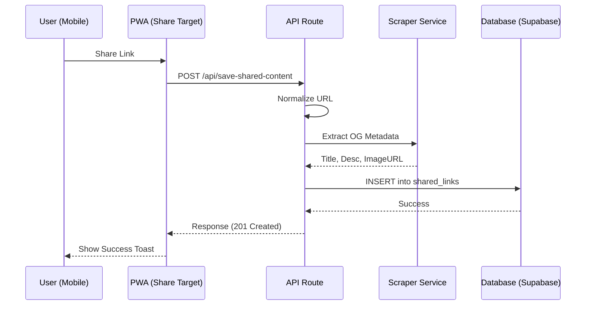

# Technical Architecture

## 🏛 System Overview
Refine is built as a cloud-native, serverless application. It prioritizes mobile responsiveness, offline capabilities (PWA), and real-time data consistency.

### 🔝 Core Principles
1. **Security First**: All data access is controlled via Row Level Security (RLS) at the database level.
2. **Performance**: Minimal client-side processing; heavy lifting (scraping, normalization) happens in API routes.
3. **Availability**: PWA architecture ensures the app remains interactive even on spotty mobile connections.

---

## 🏗 Component Architecture

### 1. Frontend (Next.js & React)
- **Pages Router**: Used for its stability and mature ecosystem.
- **Context API**: Manages global state for Authentication and UI themes.
- **Custom Hooks**: Encapsulates logic for link actions, YouTube playlist management, and category fetching.
- **Tailwind CSS 4**: Utilizes the latest CSS engine for rapid, high-performance styling.

### 2. API Layer (Next.js API Routes)
- **Authentication Middleware**: Custom `withAuth` wrapper validates Supabase JWTs.
- **Metadata Scraper**: Uses `Cheerio` for high-speed HTML parsing.
- **URL Normalizer**: Ensures data integrity by stripping tracking IDs and standardizing formats.

### 3. Backend (Supabase)
- **PostgreSQL**: Stores all relational data.
- **Supabase Auth**: Handles Google OAuth and session management.
- **Row Level Security**: Each table has strict policies: `auth.uid() == user_id`.
- **Storage**: (Planned) Used for caching scraped thumbnails to avoid broken images from external hosts.

---

## 🔄 Data Flow: Saving a Link



---

## 📈 Proposed Technical Improvements

### 1. Database Optimization
- **Full-Text Search (FTS)**: Implement `tsvector` and `tsquery` in PostgreSQL for efficient search across titles and descriptions.
- **Materialized Views**: For user statistics (e.g., links saved by category) to reduce query load on the main dashboard.

### 2. Scaling the Scraper
- **Headless Fallback**: Introduce a service like `browserless.io` or Playwright for sites that require JavaScript rendering (SPAs).
- **Proxy Rotation**: To prevent IP blocking by major platforms (X, LinkedIn).

### 3. Caching Strategy
- **Redis (Upstash)**: Cache scraped metadata to prevent redundant requests for popular links.
- **SWR/TanStack Query**: Implement for client-side data fetching to handle caching, revalidation, and optimistic updates.

---

## 🛡 Security Architecture

### Authentication
- **Provider**: Google OAuth 2.0.
- **Token Management**: Supabase handles JWT issuance and refresh.
- **API Protection**: All routes check the `Authorization: Bearer <token>` header.

### Data Privacy (RLS)
```sql
-- Comprehensive RLS example
ALTER TABLE shared_links ENABLE ROW LEVEL SECURITY;

CREATE POLICY "individual_user_policy" ON shared_links
AS PERMISSIVE FOR ALL
TO authenticated
USING (auth.uid() = user_id)
WITH CHECK (auth.uid() = user_id);
```

---
*Last Updated: January 2026*
